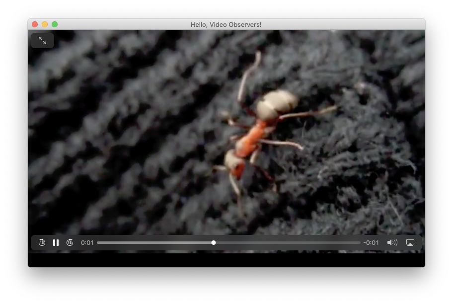

# Video 1.1.0
## [ Glimmer Custom Widget](https://github.com/AndyObtiva/glimmer#custom-widget-gem)
[](http://badge.fury.io/rb/glimmer-cw-video)
[](https://travis-ci.com/github/AndyObtiva/glimmer-cw-video)
[](https://coveralls.io/github/AndyObtiva/glimmer-cw-video?branch=master)
[](https://codeclimate.com/github/AndyObtiva/glimmer-cw-video/maintainability)
[](https://gitter.im/AndyObtiva/glimmer?utm_source=badge&utm_medium=badge&utm_campaign=pr-badge&utm_content=badge)


Video is a [Glimmer DSL for SWT Custom Widget](https://github.com/AndyObtiva/glimmer-dsl-swt/blob/master/docs/reference/GLIMMER_GUI_DSL_SYNTAX.md#custom-widgets) for playing videos via the `video` [Glimmer DSL](https://github.com/AndyObtiva/glimmer#glimmer-dsl-syntax) keyword.

## Platforms

This has been tested and confirmed to be working on:
- Mac
- Windows

## Pre-requisites

- [Glimmer DSL for SWT](https://github.com/AndyObtiva/glimmer-dsl-swt) application, [Glimmer DSL for SWT custom shell](https://github.com/AndyObtiva/glimmer-dsl-swt/blob/master/docs/reference/GLIMMER_GUI_DSL_SYNTAX.md#custom-shells), or another [Glimmer DSL for SWT custom widget](https://github.com/AndyObtiva/glimmer-dsl-swt/blob/master/docs/reference/GLIMMER_GUI_DSL_SYNTAX.md#custom-widgets)
- [JRuby version required by Glimmer DSL for SWT](https://github.com/AndyObtiva/glimmer-dsl-swt#pre-requisites)
- [Java version required by Glimmer DSL for SWT](https://github.com/AndyObtiva/glimmer-dsl-swt#pre-requisites)

## Setup

### Glimmer Application

Add the following to a [Glimmer DSL for SWT](https://github.com/AndyObtiva/glimmer-dsl-swt) application `Gemfile`:

```ruby
gem 'glimmer-cw-video', '1.1.0'
```

Run:

```
jruby -S bundle
```

(or just `bundle` if using RVM)

### Glimmer Custom Shell or Glimmer Custom Widget

When reusing the video custom widget in a [Glimmer DSL for SWT custom shell](https://github.com/AndyObtiva/glimmer-dsl-swt/blob/master/docs/reference/GLIMMER_GUI_DSL_SYNTAX.md#custom-shells) or [custom widget](https://github.com/AndyObtiva/glimmer-dsl-swt/blob/master/docs/reference/GLIMMER_GUI_DSL_SYNTAX.md#custom-widgets), you can follow the same steps for a [Glimmer DSL for SWT](https://github.com/AndyObtiva/glimmer-dsl-swt) application, and then add a require statement to your library file:

```ruby
require 'glimmer-cw-video'
# ... more require statements follow
```

## API Options

Here are the options to pass in as hash arguments to the `video` widget keyword (see in [Samples](#samples)):
- `autoplay` (true [default] or false): plays video automatically as soon as loaded
- `controls` (true [default] or false): displays controls
- `looped` (true or false [default]): plays video in looped mode
- `background` (Glimmer color [default: white]): sets background color just like with any other widget
- `fit_to_width` (true [default] or false): fits video width to widget allotted width regardless of video's original size. Maintains video aspect ratio.
- `fit_to_height` (true [default] or false): fits video height to widget allotted height regardless of video's original size. Maintains video aspect ratio.
- `offset_x` (integer [default: 0]): offset from left border. Could be a negative number if you want to show only an area of the video. Useful when fit_to_width is false to pick an area of the video to display.
- `offset_y` (integer [default: 0]): offset from top border. Could be a negative number if you want to show only an area of the video. Useful when fit_to_height is false to pick an area of the video to display.

## API Methods

- `#play`: plays video
- `#pause`: pauses video
- `#toggle`: toggles video playback, playing if paused, and pausing if playing.
- `#reload`: reloads video restarting from beginning
- `#position`: position in seconds (and fractions)
- `#position=`: seeks a new position in video
- `#duration`: length of video, maximum video position possible
- `#loaded?`: returns true when video has been initially loaded or reloaded
- `#playing?`: returns true when video is actively playing
- `#paused?`: returns true when video is not playing
- `#ended?`: returns true when video has reached the end (position == duration)
- `#volume`: returns video volume (0.0 - 1.0 float value)
- `#volume=`: sets video volume (0.0 - 1.0 float value)
- `#volume_up(value=0.05)`: bumps video volume up by a specified value or default
- `#volume_down(value=0.05)`: bumps video volume down by a specified value or default
- `#mute`: mutes video
- `#unmute`: unmutes video
- `#muted?`: returns true if video is muted
- `#toggle_muted`: mutes/unmutes video depending on `muted?` attribute


## API Observer Events

(see in [Samples](#samples))

- `on_loaded`: invoked when video `#loaded?` becomes true
- `on_ended`: invoked when video `#ended?` becomes true
- `on_playing`: invoked when video `#playing?` becomes true
- `on_paused`: invoked when video `#paused?` becomes true

## Samples

Run this command after installing the gem to list available Video samples via the Glimmer Meta-Sample (note that you would have to restart the Glimmer Meta-Sample after every Video sample run because of an unresolved minor issue):

```
glimmer samples
```

### Hello, Video!

Run from Glimmer Meta-Sample or by cloning this project and executing:

```
glimmer samples/video/hello_video.rb
```

Glimmer Code (from [samples/video/hello_video.rb](samples/video/hello_video.rb)):

```ruby
require_relative '../../lib/glimmer-cw-video'

include Glimmer

video_file = File.expand_path('../videos/Clouds_passing_by_CCBY_NatureClip.mp4', __FILE__)

shell {
  text 'Hello, Video!'
  minimum_size 384, 240
  
  video(file: video_file)
}.open
```

Glimmer App:


### Hello, Looped Video with Black Background!

Run from Glimmer Meta-Sample or by cloning this project and executing:

```
glimmer samples/video/hello_looped_video_with_black_background.rb
```

Glimmer Code (from [samples/video/hello_looped_video_with_black_background.rb](samples/video/hello_looped_video_with_black_background.rb)):

```ruby
require_relative '../../lib/glimmer-cw-video'

include Glimmer

video_file = File.expand_path('../videos/Blackpool_Timelapse.mp4', __FILE__)

shell {
  text 'Hello, Looped Video with Black Background!'
  minimum_size 1024, 640

  video(file: video_file, looped: true, background: :black)
}.open
```

Glimmer App:


### Hello, Video Observers!

Run from Glimmer Meta-Sample or by cloning this project and executing:

```
glimmer samples/video/hello_video_observers.rb
```

Glimmer Code (from [samples/video/hello_video_observers.rb](samples/video/hello_video_observers.rb)):

```ruby
require_relative '../../lib/glimmer-cw-video'

include Glimmer

video_file = File.expand_path('../videos/Ants.mp4', __FILE__)

def display_video_status(video, status)
  message_box {
    text status
    message "#{video.position.round(2)}/#{video.duration.round(2)} seconds have elapsed."
  }.open
end

@shell = shell {
  text 'Hello, Video Observers!'
  minimum_size 800, 500

  @video = video(file: video_file, background: :black) {
    on_swt_show { |event|
      # set focus as soon as the SWT widget is shown to grab keyboard events below
      @video.set_focus
    }
    
    on_key_pressed { |event|
      case event.keyCode
      when swt(:space), swt(:cr)
        @video.toggle
      when swt(:arrow_left)
        @video.rewind
      when swt(:arrow_right)
        @video.fast_forward
      when swt(:arrow_up)
        @video.volume_up
      when swt(:arrow_down)
        @video.volume_down
      end
    }
    
    on_playing {
      display_video_status(@video, 'Playing')
    }
    
    on_paused {
      display_video_status(@video, 'Paused')
    }
    
    on_ended {
      display_video_status(@video, 'Ended')
    }
  }
}
@shell.open
```

Glimmer App:



Dialog for video playing event:


Dialog for video paused event:


Dialog for video ended event:


## TODO

[TODO.md](TODO.md)

## Change Log

[CHANGELOG.md](CHANGELOG.md)

## Contributing to glimmer-cw-video
 
- Check out the latest master to make sure the feature hasn't been implemented or the bug hasn't been fixed yet.
- Check out the issue tracker to make sure someone already hasn't requested it and/or contributed it.
- Fork the project.
- Start a feature/bugfix branch.
- Commit and push until you are happy with your contribution.
- Make sure to add tests for it. This is important so I don't break it in a future version unintentionally.
- Please try not to mess with the Rakefile, version, or history. If you want to have your own version, or is otherwise necessary, that is fine, but please isolate to its own commit so I can cherry-pick around it.

## License

[MIT](LICENSE.txt)

Copyright (c) 2020-2023 - Andy Maleh.

--

[](https://github.com/AndyObtiva/glimmer-dsl-swt) Built for [Glimmer DSL for SWT](https://github.com/AndyObtiva/glimmer-dsl-swt) (JRuby Desktop Development GUI Framework).
